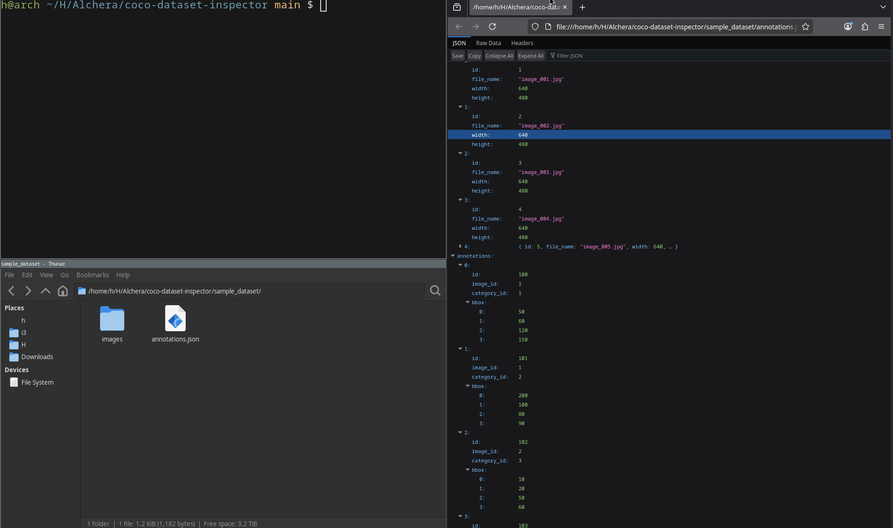

# COCO Dataset Inspector

COCO 형식의 데이터셋을 검사하고 분석하기 위한 CLI 도구입니다.

이 도구는 COCO JSON annotation 파일을 파싱하여 데이터셋 통계를 분석하고,  
annotation 오류, 이미지 누락, 잘못된 bounding box 등과 같은 일반적인 데이터셋 문제를 탐지합니다.

---

## 데모



---

## 주요 기능

### 데이터셋 통계 분석

다음과 같은 데이터셋 통계를 계산합니다.

- 전체 이미지 수
- 전체 annotation 수
- 카테고리 수
- 이미지당 평균 annotation 수
- 이미지당 최소 / 최대 annotation 수
- annotation이 존재하는 이미지 수
- annotation이 없는 이미지 수

---

### 데이터 무결성 검사

데이터셋에서 자주 발생하는 오류를 자동으로 검사합니다.

#### Annotation 검사

- 중복 annotation ID
- 필수 필드 누락

#### Category 검사

- 존재하지 않는 category를 참조하는 annotation

#### Image 검사

- 존재하지 않는 image를 참조하는 annotation
- 디스크에 실제 파일이 존재하지 않는 이미지
- annotation이 하나도 없는 이미지

#### Bounding Box 검사

- 잘못된 bbox 크기 (width 또는 height ≤ 0)
- 이미지 경계를 벗어난 bbox

---

## 프로젝트 구조

```

coco-dataset-inspector/
│
├── analyzers/
│   └── dataset_stats.py
│
├── models/
│   └── coco_dataset.py
│
├── parsers/
│   └── coco_parser.py
│
├── validators/
│   ├── annotation_validator.py
│   ├── bbox_validator.py
│   ├── category_validator.py
│   └── image_validator.py
│
├── sample_dataset/
│   ├── images/
│   └── annotations.json
│
├── tests/
│
└── inspector.py

```

각 모듈의 역할은 다음과 같습니다.

- **parsers**  
  COCO JSON 파일을 파싱하여 Python에서 사용할 수 있는 Dataset 객체로 변환합니다.

- **models**  
  COCO 데이터 구조(images, annotations, categories)를 표현하는 데이터 모델입니다.

- **validators**  
  데이터셋의 무결성을 검사하는 검증 로직이 포함되어 있습니다.

- **analyzers**  
  데이터셋의 통계 정보를 계산합니다.

- **tests**  
  pytest 기반 자동 테스트 코드입니다.

- **inspector.py**  
  CLI에서 실행되는 메인 엔트리포인트입니다.

---

## 설치

가상환경을 생성하고 의존성을 설치합니다.

```

python -m venv .venv
source .venv/bin/activate
pip install pytest

```

---

## 사용 방법

CLI에서 다음과 같이 실행합니다.

```

python inspector.py 
--images sample_dataset/images 
--annotations sample_dataset/annotations.json

```

---

## 실행 결과 예시

```

# COCO Dataset Inspector

## Dataset Summary

Images: 5
Annotations: 8
Categories: 3
Avg annotations per image: 1.40
Min annotations per image: 0
Max annotations per image: 3
Images with annotations: 3
Images without annotations: 2

## Validation Results

Duplicate annotation IDs: 1
Annotations missing required fields: 0
Annotations with missing image references: 1
Annotations with unknown categories: 1
Missing image files: 1
Empty images: 2
Invalid bbox sizes: 1
Bboxes outside image boundaries: 1

```

---

## 테스트 실행

pytest를 사용하여 테스트를 실행할 수 있습니다.

```

pytest

```

---

## 샘플 데이터셋

레포지토리에는 테스트 및 기능 확인을 위한 작은 샘플 데이터셋이 포함되어 있습니다.

이 샘플 데이터셋에는 일부 오류가 의도적으로 포함되어 있습니다.

예:

- 중복 annotation ID
- 잘못된 bounding box
- 존재하지 않는 image reference
- 실제 파일이 없는 이미지

이러한 오류를 통해 validation 기능을 확인할 수 있습니다.

샘플 이미지 생성 방법은 아래 문서를 참고하세요.

docs/sample-images.md  
docs/sample-images-ko.md

---

## 프로젝트 목적

이 프로젝트는 다음과 같은 Python 기반 데이터 처리 도구의 구조를 보여주기 위한 예제입니다.

- COCO 데이터셋 파싱
- 데이터셋 통계 분석
- 데이터 무결성 검증
- CLI 기반 도구 설계
- pytest 기반 자동 테스트
